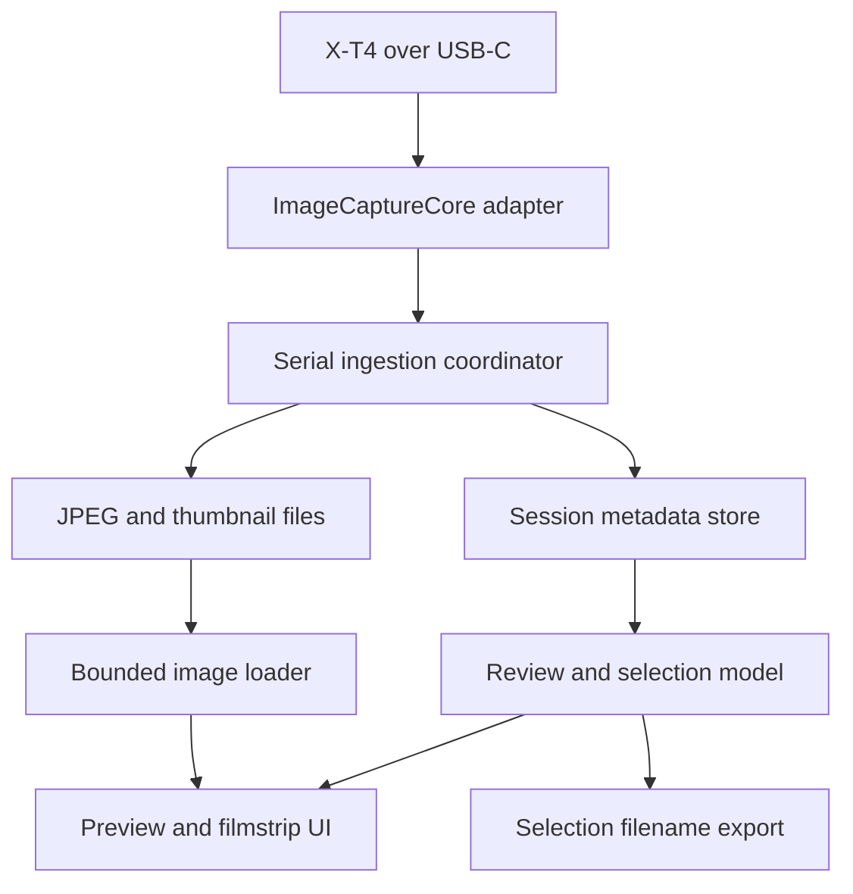
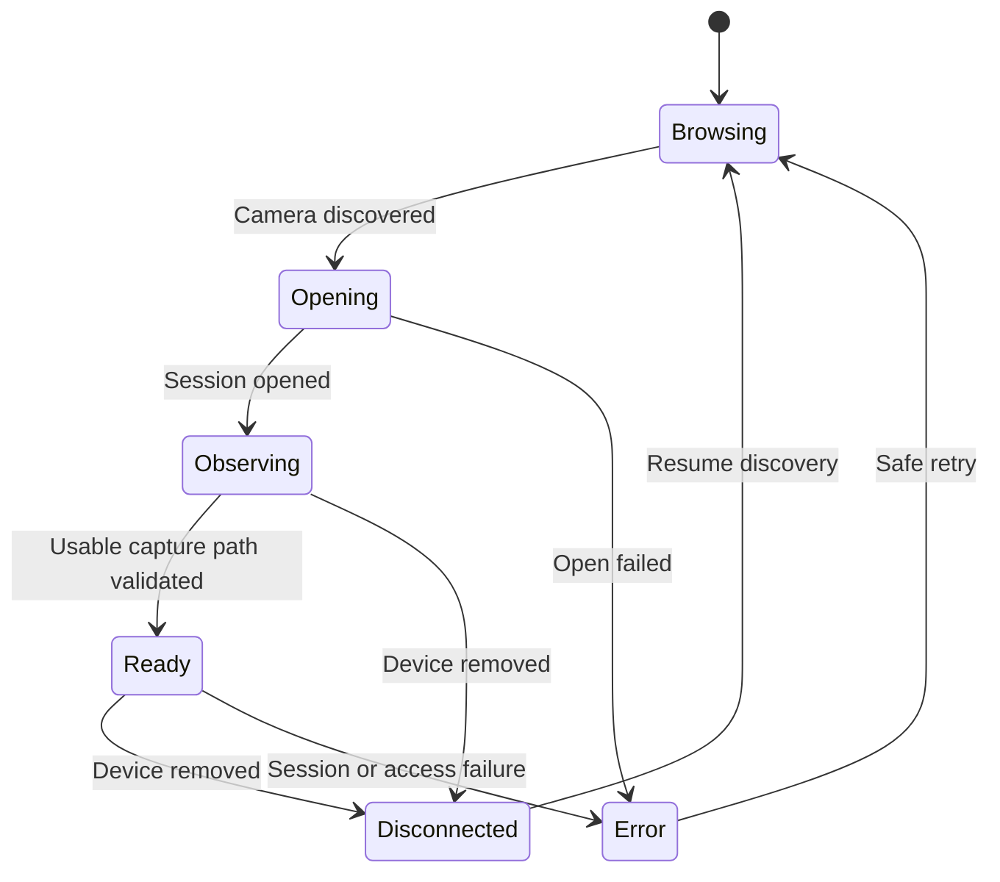

# Architecture

Baseline: 2026-09-04. **Status: proposed target architecture; no components implemented or hardware-validated in this package.** Read [DECISIONS.md](DECISIONS.md) for decision status and [PROGRESS.md](PROGRESS.md) for ordering. Do not implement the full diagram before the diagnostic probe works.

## 1. Feasibility boundary

ImageCaptureCore is the first-choice public API layer for discovery, session management, object access, and event observation. It is not an assertion that Apple translates every Fujifilm tethering behavior into a standard file-added callback.

Distinguish three questions:

1. Can iPadOS discover and open this device in the selected USB mode?
2. Does a physical-shutter capture produce an observable event and a retrievable image object?
3. Does the camera durably retain the RAW while the app copies the JPEG?

Card-reader success answers only part of the first question. A PTP event alone does not answer the second or third. If the generic path fails, capture evidence before choosing a bounded vendor-specific investigation. No Mac relay or Wi-Fi fallback is part of this architecture without owner approval.

## 2. First build: diagnostic probe

Keep the initial source structure small:

| File | Responsibility |
| --- | --- |
| FujiTetherProbeApp.swift | App entry point and lifetime ownership |
| ContentView.swift | Connection state, bounded log list, copy/share diagnostic text, start/stop |
| CameraProbe.swift | Retained browser/device, required delegate implementations, session lifecycle, event logging |

Use the installed SDK to determine exact signatures, authorization APIs, availability, and delegate isolation. Record required privacy keys/entitlements only after checking their applicability; access to an external PTP device is not automatically equivalent to AVFoundation access to the built-in camera. Do not guess key names.

Log discovery/removal, device type/transport, session completion/errors, catalog milestones, added/renamed items, file metadata when available, access restrictions, and raw PTP event bytes. No file download, shutter command, setting write, deletion, or arbitrary PTP command belongs in this build.

Retain a bounded chronological event buffer with unique log-entry IDs, wall-clock timestamps and monotonic durations. Repeated log messages are valid; their strings must not be used as SwiftUI row identity. Log thread/executor information during the probe without assuming it proves a contractual callback guarantee.

### Observation versus classification

Do not discard events while waiting for catalog completion. Label them by observed connection phase, preserve raw evidence, and provide an explicit **mark test capture now** action. The owner must wait for the app's marked observation window before pressing the shutter. This avoids incorrectly classifying existing catalog entries as new captures, and avoids hiding captures if tether mode never produces a complete catalog.

Record initial files as a baseline where possible. Correlate new objects with baseline identity and the controlled shutter test; label ambiguous observations rather than declaring all post-ready additions new photographs.

### Debugging the single USB port

The iPad's USB-C port will connect to the X-T4 during the test. Install/launch from Xcode first; use supported wireless debugging if available, or run standalone and export in-app logs afterward. Do not propose connecting both host devices with a passive USB splitter. Simulator runs validate UI only, never USB/PTP compatibility.

## 3. Target components after the gates



| Component | Owns | Does not own |
| --- | --- | --- |
| Camera adapter | Framework objects, discovery, session, observed file descriptors, bounded event logs, download requests | Client selections or image rendering |
| Ingestion coordinator | Event reconciliation, deduplication, RAW/JPEG association, one-at-a-time queue, retries, connection generation | Camera setting changes |
| File repository | Atomic JPEG placement, thumbnail storage, app-local paths, storage checks | Camera file deletion |
| Session store | Stable local IDs, provenance, transfer states, selection flags and persistence | Full-resolution bitmap memory |
| Image loader | Downsampling, decode requests, bounded cache, cancellation | Source identity or transfer ownership |
| Review model | Active capture, follow-latest setting, selection actions, connection/transfer status | USB protocol handling |
| Export service | Deterministic selected filenames and mapping warnings | Editing Lightroom catalogs or claiming RAW existence without evidence |

SwiftUI is the proposed shell and filmstrip UI. A UIKit UIScrollView-backed viewer is a candidate for predictable pinch/double-tap zoom, not an up-front dependency. ImageIO is the proposed JPEG thumbnail/downsampling layer. Metal and Core Image are unnecessary for the first acquisition path. See D-008 for persistence choices; do not select SQLite/SwiftData by habit before the needs and target OS are known.

## 4. Connection lifecycle



The catalog's readiness is tracked separately from connection readiness. The probe should show both. During production startup, usable capture-path readiness depends on the validated mode-specific behavior; it cannot be inferred from the diagram alone.

On removal: invalidate the connection generation, cancel or mark in-flight work interrupted, release device ownership according to SDK rules, retain downloaded data/selections, and return to browsing. Session close/removal callbacks may both arrive; teardown must be idempotent. Ignore late completion callbacks from the invalidated generation. Reconnect reconciliation may recover only objects still available from the camera; do not promise retrieval of lost volatile buffers.

## 5. Acquisition and persistence flow

1. Adapter receives an object/event and preserves diagnostic evidence.
2. Coordinator identifies whether it is initial catalog content, a duplicate, a new capture, a rename, or an unresolved item.
3. If a JPEG is retrievable, enqueue it. Keep RAW metadata for pairing where exposed; do not fetch the RAW by default.
4. Download to a unique temporary local path using the validated public API.
5. Confirm completion, expected byte count where meaningful, and successful JPEG decode. Handle zero-byte/truncated files explicitly.
6. Atomically move to its capture directory; persist transfer success and provenance.
7. Generate a downsampled thumbnail/display representation. Publish the capture as viewable only after the local file is valid.
8. If follow-latest is active, select the newest successfully available capture by capture ordering, not arbitrary callback completion order.

Use a serial acquisition queue initially. Bounded retries apply only to demonstrated recoverable errors; no infinite retry loop or unbounded download backlog. If volatile camera storage or mixed RAW/JPEG queueing requires a different strategy, stop and record evidence before modifying camera settings or downloading RAWs as a workaround.

## 6. Proposed logical data model

These are conceptual fields, not final Swift declarations.

| Record | Minimum fields |
| --- | --- |
| Session | Local UUID, created/updated timestamps, device label, capture order, schema version |
| Capture | Local UUID, session UUID, sequence, capture time if known, first observed time, selected flag |
| SourceObject | Local UUID, capture UUID, source filename as observed, folder/storage reference if exposed, size/type, camera identity hint, connection generation, object handle if exposed |
| LocalAsset | Capture UUID, relative JPEG/thumbnail paths, transfer state/error, byte count, completed timestamp |
| RawAssociation | Capture UUID, observed RAW reference or candidate filename, confidence: observed/inferred/unresolved |

PTP object handles may be session-scoped or reused. Filenames may repeat. Deduplication should prefer a compound source identity supported by actual observations, scoped to device/session/storage and generation; reconcile across reconnect with stronger metadata rather than treating a handle as permanent. Retain multiple legitimate captures with repeated stems and flag unresolved collisions.

RAW and JPEG may arrive out of order. Associate using observed metadata and validated naming relationships; do not pair exclusively by equal basename across the entire session. A rename must update source provenance without changing the stable capture ID or losing its selection.

## 7. Local storage and memory

Proposed relative layout under Application Support:

```text
Sessions/<session-uuid>/
  manifest.json
  Captures/<capture-uuid>/preview.jpg
  Captures/<capture-uuid>/thumbnail.jpg
```

The manifest is a provisional first implementation (D-008). Paths use app-generated IDs so camera names cannot become filesystem paths or overwrite existing assets. Preserve original names in metadata. Never use user/source filenames directly as trusted path components.

Metadata and downloaded previews persist across relaunch; decoded images do not. Persist selection changes atomically and visibly report write errors. Recovery must reconcile interrupted writes or orphaned assets without silently discarding selected captures. Large full JPEG files consume disk even if they are not all decoded; measure storage needs and warn on low capacity. Do not silently evict originals within an active session. Session deletion/retention policy requires an explicit future user action.

Bound memory with a cost-limited thumbnail cache, one current full-resolution inspection image or appropriate tiles/downsampled representation, and a small measured neighbor window. Cancel obsolete decode/prefetch requests. Memory should depend principally on the active viewing window rather than the count of captured images. Respond to memory pressure by discarding reconstructible caches, not selections or source metadata.

## 8. Review behavior

- Default follow-latest ON while actively shooting.
- Navigating to older photos pauses follow-latest; subsequent capture must not steal the image under inspection.
- A visible “Live / newest” action resumes follow-latest and resets zoom appropriately.
- Selecting a capture does not change which capture is being reviewed.
- Keep a prominent preview and a compact filmstrip; minimal technical controls.
- Pinch and double-tap allow focus inspection from the downloaded JPEG, not merely an enlarged thumbnail. If rendering is downsampled, do not mislabel it pixel-for-pixel inspection.
- Failed/in-progress captures show an honest state and do not replace a successful preview with blank content.

Dedicated Client Mode and comparisons are deferred. This default UX is proposed and can be refined after the first JPEG; see D-007.

## 9. Selection export contract

V1 exports plain text, one filename per selected capture, in stable capture order. Never silently add .RAF to every JPEG and represent the result as verified.

- **Observed RAW association:** export the exact observed RAW filename.
- **Inferred association:** visibly label it as inferred; export candidate RAW names only after explicit confirmation, or offer exact observed JPEG names.
- **Unresolved/collision:** show a warning and preserve disambiguating metadata; do not silently drop duplicate basenames or claim the list uniquely identifies Lightroom records.
- Empty selection produces an explicit empty-selection message.

The export helps manual Lightroom lookup. It is not XMP synchronization, automatic Lightroom filtering, or a guarantee of one-step bulk matching. A future CSV can carry folder/session context if simple filenames become insufficient.

## 10. Performance and extension points

Instrument observed event → queue → transfer completion → first display with monotonic timestamps. True shutter → event latency needs an external observation method; do not call app-only timings shutter latency. Report p50/p95 and errors using a specified JPEG size, cable, firmware, and OS. Set numeric performance thresholds with the owner after a baseline, not by fabrication.

Extension points are the transport boundary, capture metadata, reviewer/selection representation, export service, and image-loader interface. They permit future controls/comparison/annotation without requiring those features now. Do not build generalized multi-brand infrastructure for a one-camera proof of concept.
