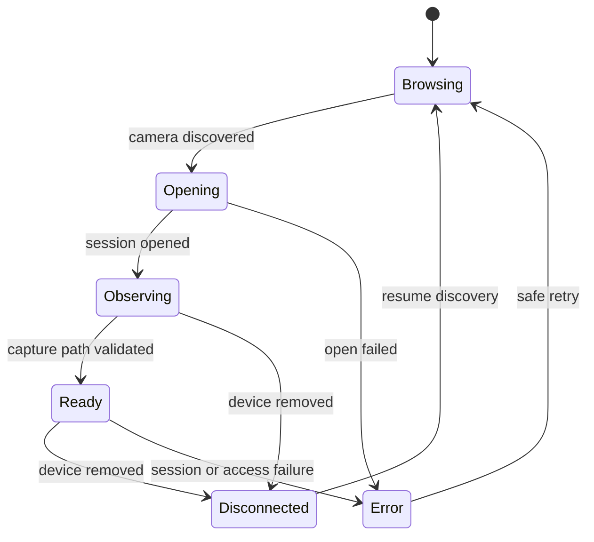
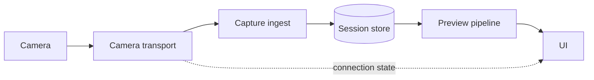

# Architecture

Shared, camera-neutral design. The adapter boundary and the shared-application rule
are defined in the root [README.md](../../README.md) → *Camera integration model*;
this document details what sits above that boundary. Vendor specifics belong in
[.github/agents/](../agents/), never here.

## Components

| Component | Responsibility |
| --- | --- |
| Camera transport (contract) | Brand-neutral: connection state, device descriptor, capture/object descriptors, declared capabilities, and an event stream. Owns no vendor detail. |
| Camera adapter (per vendor) | Implements the contract for one vendor: discovery matching, session lifecycle, event translation, non-destructive preview retrieval, error mapping. The Sony adapter additionally drives a vendor PTP handshake (D-002). Native types such as `ICCameraDevice` never escape the adapter. |
| Capture ingest | Receives raw bytes, validates completeness, writes to the session store. |
| Session store | On-disk layout of sessions and captures; the only component that writes files. |
| Preview pipeline | Decodes/downscales the latest capture for on-screen display. |
| UI | Session controls, connection state, latest-capture preview, capture list. |
| Platform shell | `App/` and `Platform/`: per-platform defaults (session and outbox roots), file-browser reveal, clipboard, root scene. The only place `#if os(...)` appears (D-014). |
| Capture source | `CaptureSource` yields complete JPEGs in the session Inbox. `FolderCaptureSource` watches a folder another app writes (Imaging Edge on the Mac, D-015); camera adapters will download into the same Inbox. |

<!-- TODO: fill in concrete types/modules once the first spike lands. -->

## Parallel adapter work

One `CameraTether` app, transport contract, diagnostic/review UI, session store,
preview pipeline, and export implementation serve both adapters. Mario leads
Fujifilm; his colleague leads Sony (owner's instruction, 2026-09-23; D-013).
Keep vendor implementation under `Camera/Adapters/Fujifilm/` or
`Camera/Adapters/Sony/`. This describes intended source placement, not existing
adapter classes or verified compatibility.

The shared bootstrap is proposed separately in PR #6. After a bench validates its
launch and SDK baseline, that vendor's observational probe can proceed independently.
Hardware gates remain separate. Review shared contracts and project-file edits
across workstreams; do not create a second application or duplicate shared modules.

## First build: the diagnostic probe

The first build observes; it does not act. No download, no shutter command, no setting
write, no deletion, no arbitrary vendor command.

Log discovery and removal, device type and transport, session completion and errors,
catalog milestones, added and renamed items, file metadata where available, access
restrictions, and raw PTP event bytes — preserved as bytes, not decoded speculatively.
Keep a bounded chronological buffer with unique entry IDs, wall-clock timestamps, and
monotonic durations. Repeated log messages are legitimate; their text must never be
used as row identity.

### Telling a new capture from the existing catalog

The hard problem in the probe is not seeing events — it is knowing what they mean.

- Do not discard events while waiting for catalog completion. Label them by observed
  connection phase and keep the raw evidence.
- Record the initial file list as a **baseline** where the mode allows it.
- Give the operator an explicit **"mark test capture now"** action, and press the
  shutter only inside that marked window. Correlate new objects against both the
  baseline and the marked window.
- Label ambiguous observations as ambiguous. Do not declare every post-ready addition
  a new photograph, and do not assume a missing catalog-ready callback means no
  captures arrived.

### The single-port problem

The iPad has one port, and the camera is in it. That rules out being attached to Xcode
while tethered.

Install and launch from Xcode first, then run standalone and export the in-app logs
afterwards — which is why the probe needs copy/share of its log text as a real feature,
not a nicety. Use wireless debugging where available. Never propose a passive USB
splitter. On the Sony bench the Camera Adapter's second socket is **charging
passthrough only** and does not give back a debug path. A simulator run validates UI
and nothing about USB or PTP.

## Connection lifecycle



Catalog readiness is tracked **separately** from connection readiness; the probe shows
both. Reaching `Ready` depends on mode-specific behavior that has been validated for
that adapter — it cannot be inferred from this diagram.

On removal: invalidate the connection generation, cancel or mark in-flight work
interrupted, release device ownership per SDK rules, keep downloaded data and
selections, return to browsing. Close and removal callbacks may both arrive, so
teardown is idempotent. Late completions from an invalidated generation are ignored.
Reconnect recovers only objects the camera still has — never promise retrieval of lost
volatile buffers.

## Capture-to-preview flow

```mermaid
sequenceDiagram
    participant Cam as Camera
    participant T as Camera transport
    participant I as Capture ingest
    participant S as Session store
    participant P as Preview pipeline
    participant UI

    Note over T,Cam: Session ready; Sony additionally needs D-002 handshake
    Cam->>T: new object event
    T->>I: capture bytes (streamed)
    I->>S: write file (atomic rename on completion)
    S-->>P: capture committed
    P->>P: decode + downscale
    P-->>UI: preview image
```

## Acquisition sequence

1. Adapter receives an object or event and preserves the diagnostic evidence.
2. Coordinator classifies it: initial catalog content, duplicate, new capture, rename, or unresolved.
3. If a JPEG is retrievable, enqueue it. Keep RAW metadata for pairing where exposed; do not fetch the RAW (D-005).
4. Download to a unique temporary path.
5. Confirm completion, expected byte count where meaningful, and a successful decode. Handle zero-byte and truncated files explicitly.
6. Atomically move into the capture directory; persist transfer success and provenance.
7. Generate the downsampled display representation. Publish the capture as viewable **only after** the local file is valid.
8. If follow-latest is active, select the newest capture by capture ordering — never by callback completion order (D-007).

Acquisition is a serial queue to start (D-009). Bounded retries apply only to errors
demonstrated to be recoverable. If volatile camera storage or mixed RAW/JPEG queueing
seems to demand another strategy, stop and record the evidence — do not work around it
by changing camera settings or downloading RAWs.

## Storage

- One directory per session: `Sessions/<yyyy-MM-dd_HHmmss>/`.
- Captures are written to a temp name and renamed on completion so partial files are never mistaken for good ones.
- Sidecar `session.json` records camera identity, start time, and capture manifest.
- Location: the app's Documents directory, exposed to the Files app (D-003). Captures are therefore **user-mutable** — `session.json` records what was transferred, and readers must tolerate files having been renamed or deleted from underneath it.
- Capture filenames follow the camera's own pattern; on the current rig that is `DSC#####.JPG` / `DSC#####.ARW`.

## Logical data model

Conceptual fields, not final Swift declarations. Identity rules come from D-008.

| Record | Minimum fields |
| --- | --- |
| Session | Local UUID, created/updated timestamps, device label, capture order, schema version |
| Capture | Local UUID, session UUID, sequence, capture time if known, first-observed time, selected flag |
| SourceObject | Local UUID, capture UUID, source filename **as observed**, storage/folder reference if exposed, size/type, camera identity hint, connection generation, object handle if exposed |
| LocalAsset | Capture UUID, relative JPEG/thumbnail paths, transfer state/error, byte count, completed timestamp |
| RawAssociation | Capture UUID, observed RAW reference or candidate filename, confidence: observed / inferred / unresolved |

Constraints this model exists to enforce:

- PTP object handles may be session-scoped or reused, and camera filenames repeat once the counter rolls over. Deduplicate on a compound source identity scoped to device, storage, and connection generation — never on a handle or a basename alone.
- RAW and JPEG may arrive out of order, and a file may appear under a temporary name and then be renamed. A rename updates source provenance without changing the capture's stable ID or losing its selection.
- Keep multiple legitimate captures that share a filename stem; flag unresolved collisions rather than collapsing them.
- App-generated IDs are the path components on disk, so a camera-supplied name can never become a filesystem path or overwrite an existing asset. Original names live in metadata.

## Selection export contract

V1 exports plain text, one filename per selected capture, in stable capture order (D-006, D-008).

- **Observed** RAW association: export the exact observed RAW filename.
- **Inferred**: label it as inferred; export candidate RAW names only after explicit confirmation, or offer the exact observed JPEG names instead.
- **Unresolved / collision**: warn and preserve disambiguating metadata; never silently drop duplicate basenames.
- **Empty selection**: an explicit empty-selection message, not a blank export.

This aids manual Lightroom lookup. It is not XMP synchronization, automatic catalog filtering, or a guarantee of one-step bulk matching.

## Concurrency

- Transport runs on its own serial queue/actor; it never touches UI.
- Ingest is serial per session (captures arrive in order; ordering must be preserved).
- Preview decode runs off the main thread; only the final image hops to the main actor.

## Memory limits

- Never hold more than one full-resolution capture in memory at a time.
- Previews are downscaled to screen resolution before caching.
- Preview cache is bounded (LRU, size TBD) and evicts under memory pressure.
- Memory depends on the **active viewing window**, not the number of captures taken (D-009). Obsolete decode and prefetch requests are cancelled.
- Under memory pressure, discard reconstructible caches only — never selections or source metadata.
- Disk is a separate budget: full JPEGs consume space whether or not they are decoded. Warn on low capacity; never silently evict originals during an active session.

## Disconnect handling

| Event | Behavior |
| --- | --- |
| Cable pulled mid-transfer | Partial file discarded; session stays open; UI shows "reconnecting". |
| Cable reconnected | Transport re-enumerates and resumes the same session. |
| Camera powered off | Same as cable pulled. |
| App backgrounded | Transfer continues for as long as iPadOS allows; state saved on suspend. Document what is actually observed — do not claim background acquisition works until measured. |
| Late reply from a dead connection | Rejected by the connection-generation check; cannot mutate the replacement session (D-009). |
| Reconnect after completed transfers | Reconciliation must not duplicate captures already downloaded. |
| Low storage or write failure | Visible error; no overwrite, and no falsely persisted success or selection. |
| Authorization denied or restricted | Clear, actionable state; no infinite retry loop. |

## Component diagram


