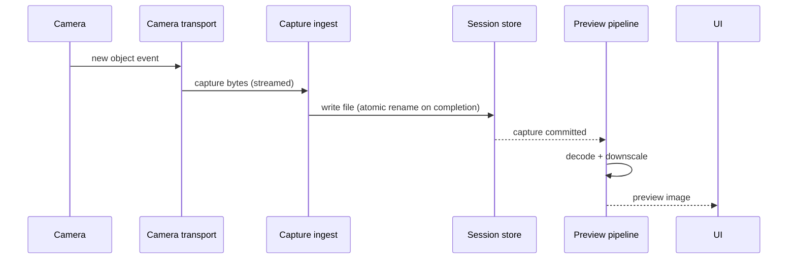
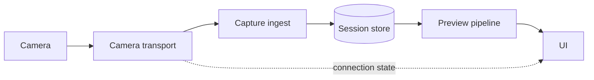

# Architecture

## Components

| Component | Responsibility |
| --- | --- |
| Camera transport | Enumerates the connected camera, negotiates the protocol, streams new captures. |
| Capture ingest | Receives raw bytes, validates completeness, writes to the session store. |
| Session store | On-disk layout of sessions and captures; the only component that writes files. |
| Preview pipeline | Decodes/downscales the latest capture for on-screen display. |
| UI | Session controls, connection state, latest-capture preview, capture list. |

<!-- TODO: fill in concrete types/modules once the first spike lands. -->

## Capture-to-preview flow

## Storage

- One directory per session: `Sessions/<yyyy-MM-dd_HHmmss>/`.
- Captures are written to a temp name and renamed on completion so partial files are never mistaken for good ones.
- Sidecar `session.json` records camera identity, start time, and capture manifest.

<!-- TODO: decide app sandbox vs. Files-app-visible location — see DECISIONS.md. -->

## Concurrency

- Transport runs on its own serial queue/actor; it never touches UI.
- Ingest is serial per session (captures arrive in order; ordering must be preserved).
- Preview decode runs off the main thread; only the final image hops to the main actor.

## Memory limits

- Never hold more than one full-resolution capture in memory at a time.
- Previews are downscaled to screen resolution before caching.
- Preview cache is bounded (LRU, size TBD) and evicts under memory pressure.

## Disconnect handling

| Event | Behavior |
| --- | --- |
| Cable pulled mid-transfer | Partial file discarded; session stays open; UI shows "reconnecting". |
| Cable reconnected | Transport re-enumerates and resumes the same session. |
| Camera powered off | Same as cable pulled. |
| App backgrounded | Transfer continues for as long as iPadOS allows; state saved on suspend. |

## Component diagram

