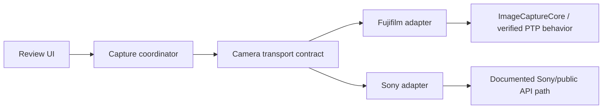

# CameraTether

Documentation baseline: 2026-09-04. Working project name: **CameraTether**.

## Start here

Build a native iPadOS app that turns an iPad into a portable review monitor for photographs taken with the physical shutter of a supported camera connected over USB-C. The first hardware target is the **Fujifilm X-T4**, with Sony support developed through a separate adapter against the same shared application. The app is a capture-preview-review-selection companion, not a Lightroom replacement.

**Current reality:** this package contains design documents, not a working application. Earlier conversation proposed a diagnostic Swift implementation, but no successful build, physical-device test, or PTP trace has been reported. Device discovery, new-capture access in tether mode, and card retention must be verified. Do not treat the earlier code as an SDK-validated starter project.

## Development toolchain

The application is an Apple-platform project, so **Xcode and the Apple SDK are required** even when code is edited in another editor.

| Tool | Role |
| --- | --- |
| Xcode | Canonical `.xcodeproj`, Apple SDK, signing, capabilities, simulator, device installation/debugging, Instruments, asset catalogs, and release archives |
| VS Code | Optional primary editor for Swift, Markdown, Git, terminal commands, and AI-assisted changes |
| Command line | Reproducible builds and tests through the active Xcode toolchain, primarily `xcodebuild` and `xcrun` |

A supported workflow is to edit in VS Code and open Xcode only for project settings, signing, simulator/device work, visual debugging, and profiling. VS Code does not replace Xcode's installed toolchain or signing/deployment workflow. Keep `CameraTether.xcodeproj` as the application build source of truth; do not create a competing build definition for the app target.

Before the first implementation commit, record these outputs and the device/camera versions in STATUS:

```bash
xcodebuild -version
xcrun swift --version
```

Use the current stable Xcode compatible with the development Mac and iPad. A free Apple developer account is sufficient for testing on an owned device; distribution and TestFlight have separate membership requirements.

## Creating the Xcode project

Create **iOS → App**, not a Multiplatform or document-based template.

| Setting | Initial value |
| --- | --- |
| Product name | `CameraTether` |
| Organization identifier | A stable reverse-domain identifier owned/controlled by the developer |
| Interface | SwiftUI |
| Language | Swift |
| Testing system | Swift Testing |
| Storage | None |
| Test target | Included |
| Source control | Git repository included |

Then:

1. Make the app iPad-only under the app target's supported destinations.
2. Select the lowest iPadOS version the project is prepared to test. For the prototype, iPadOS 17 is a reasonable baseline if the physical iPad supports it; record the actual choice in STATUS.
3. Keep portrait and landscape orientations enabled.
4. Use automatic signing and an appropriate development team.
5. Add no capabilities, entitlements, background modes, or privacy keys until the relevant API/documentation or a concrete system error establishes the requirement.
6. Keep the generated Swift language and concurrency settings. Resolve framework-boundary diagnostics deliberately instead of downgrading the entire target or adding broad unchecked concurrency annotations.
7. Build an empty app in an iPad simulator, then install and launch it on the physical iPad before adding ImageCaptureCore.

Do not add external dependencies initially. When a dependency becomes justified, prefer Swift Package Manager and record the purpose, version, license, and removal cost.

## Repository layout

Keep the root human-facing README and a small root `AGENTS.md`. Detailed project and agent instructions live under `.github` and do not need app target membership. The root `AGENTS.md` is intentionally retained because agent discovery from nested `.github` directories is tool-dependent; it directs agents to the applicable shared and camera-specific instructions.

```text
CameraTether/
├── AGENTS.md
├── README.md
├── .gitignore
├── .github/
│   ├── project/
│   │   ├── ARCHITECTURE.md
│   │   ├── DECISIONS.md
│   │   ├── PROGRESS.md
│   │   ├── STATUS.md
│   │   └── VALIDATION.md
│   └── agents/
│       ├── shared/
│       │   └── AGENTS.md
│       ├── fujifilm/
│       │   └── AGENTS.md
│       └── sony/
│           └── AGENTS.md
├── CameraTether.xcodeproj
├── CameraTether/
│   ├── App/
│   │   └── CameraTetherApp.swift
│   ├── Features/
│   │   └── Diagnostics/
│   │       └── DiagnosticView.swift
│   ├── Camera/
│   │   ├── Core/
│   │   │   ├── CameraTransport.swift
│   │   │   ├── CameraEvent.swift
│   │   │   ├── CameraObject.swift
│   │   │   └── CameraCapabilities.swift
│   │   └── Adapters/
│   │       ├── Fujifilm/
│   │       └── Sony/
│   ├── Models/
│   ├── Storage/
│   └── Resources/
└── CameraTetherTests/
```

The root `AGENTS.md` should remain small and route work to `.github/agents/shared/AGENTS.md` plus the applicable Fujifilm or Sony instructions. Shared architecture, decisions, progress, status, and validation remain authoritative under `.github/project`; do not duplicate them independently for each camera.

Make Xcode groups mirror real directories. Avoid catch-all folders such as `Helpers`, `Managers`, or `Utils`; organize by responsibility. The first probe should remain small—an app entry point, diagnostic view, event model, and ImageCaptureCore probe are sufficient.

## Camera integration model

The Fujifilm and Sony adapters are parallel camera-integration workstreams against one shared application. A model is supported only after its exact hardware/firmware path passes the required validation; parallel development does not imply equal readiness or compatibility.

### Workstream ownership

Per the owner's instruction on 2026-09-23:

| Workstream | Lead | Scope |
| --- | --- | --- |
| Fujifilm X-T4 | Mario | Fujifilm adapter, USB-C iPad Air 4 tests, and X-T4 compatibility evidence |
| Sony a7R III | Mario's colleague; name not supplied | Sony adapter and its separate hardware validation |
| Shared application | Both contributors | App target, transport contract, diagnostic UI, storage, previews, review, and selections |

Fujifilm work is tracked in [its adapter instructions](.github/agents/fujifilm/AGENTS.md) and W-019–W-024 in the [shared backlog](.github/project/PROGRESS.md). Sony keeps its existing work items and gates. Each adapter can advance independently once its own prerequisites pass; neither adapter's success proves compatibility for the other.

Use the same `CameraTether.xcodeproj` for both. Shared files and project/target settings need explicit review by the other contributor when they affect both workstreams. Keep vendor logic under `Camera/Adapters/Fujifilm/` or `Camera/Adapters/Sony/`; do not create a second app or copy shared features into an adapter.



The core application owns brand-neutral concepts: connection state, a discovered device descriptor, capture/object descriptors, transfer state, local assets, selections, and export. A camera adapter owns vendor/framework details: discovery matching, session lifecycle, capability reporting, event translation, safe JPEG retrieval, and error mapping.

### Shared application rule

> **Fujifilm and Sony are adapters to the same application. They are not separate implementations of the app.** All product behavior above the camera transport boundary must be implemented once and shared by every adapter.

| Shared between all camera adapters | Implemented inside each camera adapter |
| --- | --- |
| SwiftUI screens and navigation | Compatible-device identification |
| Capture/session coordinator | Framework, SDK, or PTP session lifecycle |
| Connection and transfer state models | Vendor/model-specific event interpretation |
| Capture identity and provenance models | Mapping native objects into shared models |
| JPEG storage and atomic file handling | Requesting/retrieving the preview through the vendor path |
| Thumbnail generation and image cache | Vendor/model capability reporting |
| Filmstrip, preview, zoom, and follow-latest behavior | Translating native errors into shared transport errors |
| Selection persistence and counts | Vendor-specific reconnect or acknowledgement behavior |
| Filename/Lightroom handoff export | Model/firmware compatibility checks |
| Logging presentation and diagnostics UI | Raw vendor diagnostics needed to validate the adapter |
| Unit tests for brand-neutral workflows | Hardware tests for the exact supported camera models |

Shared modules must depend on `CameraTransport`, `CameraEvent`, `CameraObject`, and explicit capabilities—not on `FujifilmCameraAdapter`, `SonyCameraAdapter`, manufacturer strings, vendor opcodes, or SDK-specific types. Native objects such as `ICCameraDevice` must not escape the adapter into the UI, session store, or selection/export layers.

An adapter must not duplicate the gallery, storage, cache, session, selection, or export stack. If adding a camera appears to require copying one of those modules, first determine whether the shared contract is missing a brand-neutral concept. Extend that contract only with behavior supported by evidence; do not add a vendor-shaped method merely to make one adapter convenient.

Capabilities prevent the shared API from becoming a false lowest-common-denominator abstraction. The core can conditionally expose an optional feature based on a declared, verified capability while retaining one shared implementation of the feature's UI and workflow.

The eventual transport boundary should be small and based on behavior demonstrated by the probe. A conceptual shape is:

```swift
protocol CameraTransport: AnyObject {
    var events: AsyncStream<CameraEvent> { get }

    func start() async throws
    func stop() async
    func downloadPreview(for source: CameraObject) async throws -> URL
}
```

This is an architectural direction, not code to paste before SDK validation. ImageCaptureCore is delegate-based, and the final adapter may bridge callbacks to an async event stream differently. Do not force vendor-specific information into a misleading universal interface; expose capabilities explicitly and allow unsupported operations.

### Adding another camera adapter

To implement or extend the Sony adapter:

1. Create a compatibility proposal covering the exact camera model, firmware, connection mode, public SDK/API, license, and RAW/card-retention behavior.
2. Add a Sony-specific adapter under `Camera/Adapters/Sony/`; do not add `if manufacturer == "Sony"` branches to views or persistence code.
3. Translate only verified Sony events/objects into the brand-neutral `CameraEvent` and `CameraObject` models.
4. Advertise a capability only after the exact body/model/firmware path passes physical-device validation. Model names and USB vendor strings are not sufficient proof.
5. Use a dedicated fake adapter for deterministic core tests and real Sony hardware for compatibility gates. Fujifilm results cannot certify Sony behavior.
6. Add model-specific procedures and run records to VALIDATION; record architectural deviations in DECISIONS and the support status in STATUS.
7. Keep preview retrieval non-destructive. Verify RAW retention on the card independently before calling the camera supported.

A new adapter is accepted only when it can satisfy the core V1 flow—discover, observe a physical-shutter capture, retrieve a valid preview, reconnect safely, and preserve the camera originals—or clearly declares which capabilities remain unsupported. Simultaneous connections to multiple cameras remain deferred for V1; supporting more than one camera family does not require concurrent multi-camera operation.

## Owner and development context

The owner is a software engineer with a B.S. in Computer Engineering and backend experience. Technical explanations can assume familiarity with architecture, concurrency, protocols, debugging, and APIs. Explain Swift, Apple framework, and PTP-specific conventions where relevant. Build incrementally; provide code, execution instructions, expected observations, and debugging guidance, then wait for hardware results at the defined gates.

| Item | Context |
| --- | --- |
| Camera | Fujifilm X-T4; firmware version not supplied |
| Tablet | iPad Air 4th generation, USB-C; installed iPadOS version not supplied |
| Development host | MacBook Pro; architecture, macOS, and Xcode versions not supplied |
| Connection | Direct, data-capable USB-C cable; model/length/speed unknown |
| Existing workflow | Adobe Lightroom for final RAW processing, organization, and delivery |
| Photography | Headshots, portraits, engagements, graduations, weddings; mostly outdoors/on location |
| Lighting | Godox AD200 Pro and Godox iT30 Pro Mini for Fujifilm; no lighting integration required |
| Prior product exploration | Evoto, Capture One Mobile, Cascable Studio, Fujifilm XApp, Lightroom for iPad |

The owner reported interest in Evoto's wired X-T4 workflow and credit-based AI exports. This is motivation, not verified evidence that our chosen API path works. No commercial-app integration is required.

## Product contract

**Desired flow:** photograph on camera → JPEG appears on iPad → inspect/review → mark selections → export filenames for locating RAW files in Lightroom.

V1 must:

1. Discover the connected camera and establish a session.
2. Detect new physical-shutter captures without requiring an iPad shutter button.
3. Transfer a JPEG preview automatically, subject to hardware feasibility.
4. Show the latest successfully downloaded image prominently and maintain a session filmstrip.
5. Support navigation, pinch zoom, and double-tap focus inspection.
6. Support one simple selected/unselected flag per capture.
7. Preserve selections for the session, including app relaunch through lightweight local persistence.
8. Copy/share a newline-separated list of selected source filenames, with honest RAW mapping.
9. Remain usable with 50–1,000+ captures without retaining every decoded full-resolution image in RAM.
10. Surface disconnects and transfer failures without erasing existing previews or selections.

One selection flag represents the initial star/heart concept. Separate photographer favorites, client selections, and star ratings are deferred (D-006).

### RAW + JPEG intent and safety

Configure the camera for RAW+JPEG. Desired behavior is RAW retained on the SD card and JPEG copied to the iPad. **This is a goal, not a verified X-T4 tether-mode capability.** The app must never delete camera files, format media, or silently change capture destinations. If card retention cannot be demonstrated, stop before treating this as a usable photography workflow.

The app must not label an inferred RAF filename as an observed RAW file. Filename stems can repeat between folders/cards/sessions; they are not unique identifiers.

## Out of scope for V1

RAW development, AI edits, Lightroom catalog manipulation, cloud services, accounts, payment/credit systems, live view, camera exposure controls, app-triggered capture, burst-performance guarantees, simultaneous multi-camera connections, and background tethering guarantees.
w
Future candidates: dedicated locked-down Client Mode; A/B and 4-up comparison; ratings/color labels/rejects; histogram and clipping; EXIF and camera status; named client/shoot sessions; multiple reviewers; CSV export; preview sharing/AirDrop; external displays; Apple Pencil annotations; LUTs and local JPEG adjustments. Do not build these ahead of the gates.

## Engineering priorities

In order: reliable acquisition and RAW safety; fast previews; simple shooting UX; stable wired sessions; bounded memory; recovery from disconnection; minimal interference with camera operation. Offline local operation is the baseline. No backend is needed.

The first deliverable is **a diagnostic app**, not the full product. It logs discovery, session/catalog lifecycle, added items, raw PTP events, errors, and restrictions; it downloads or deletes nothing. Exact implementation depends on the installed SDK.

## Sources and provenance

These official sources were identified during the preceding conversation. They are reference starting points, not a fresh verification of every API signature or OS behavior on 2026-09-04. The implementing agent must verify the relevant current documentation and installed SDK before code decisions and record availability findings in STATUS.

- [Apple: ImageCaptureCore](https://developer.apple.com/documentation/imagecapturecore)
- [Apple: ICDeviceBrowser](https://developer.apple.com/documentation/imagecapturecore/icdevicebrowser)
- [Apple: ICCameraDevice](https://developer.apple.com/documentation/imagecapturecore/iccameradevice)
- [Apple: ICCameraDeviceDelegate](https://developer.apple.com/documentation/imagecapturecore/iccameradevicedelegate)
- [Apple: requestSendPTPCommand completion API](https://developer.apple.com/documentation/imagecapturecore/iccameradevice/requestsendptpcommand(_:outdata:completion:))
- [Fujifilm: X-T4 USB connection instructions](https://fujifilm-dsc.com/en/manual/x-t4/connections/computer/index.html)
- [Fujifilm: X-T4 connection settings](https://fujifilm-dsc.com/en/manual/x-t4/menu_setup/connection_setting/index.html)

The prior research identified ImageCaptureCore discovery and related camera APIs as available on iPadOS. It did not establish native X-T4 physical-shutter event delivery through those APIs. Fujifilm's manual documents card-reader and tether modes and warns about card recording behavior in FIXED mode.
